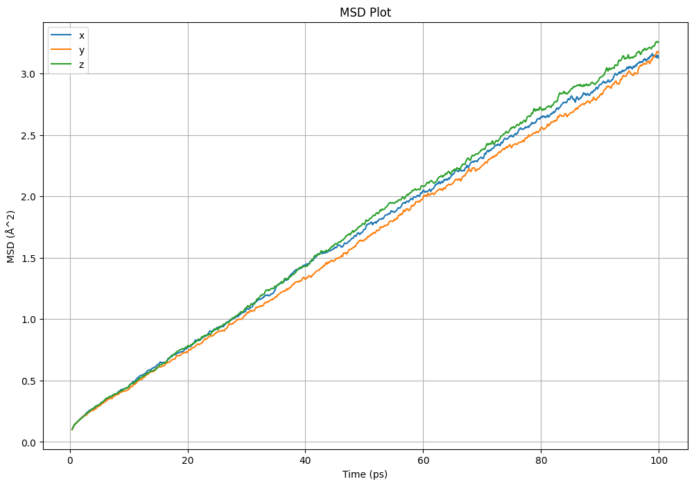
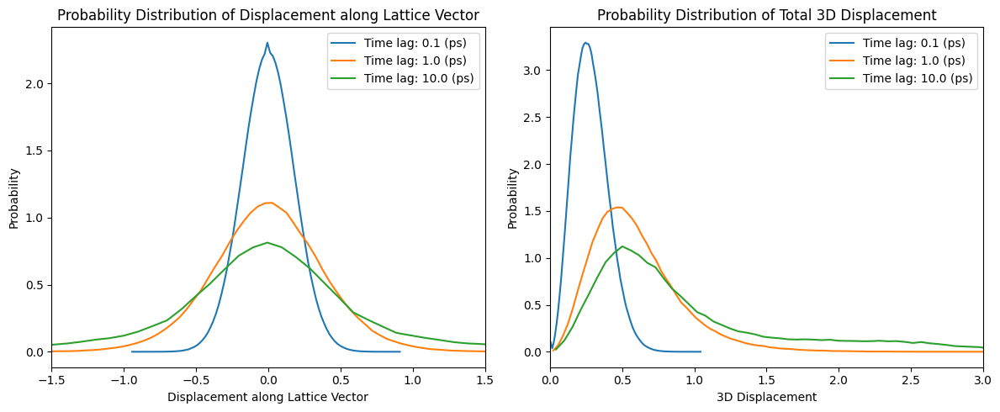
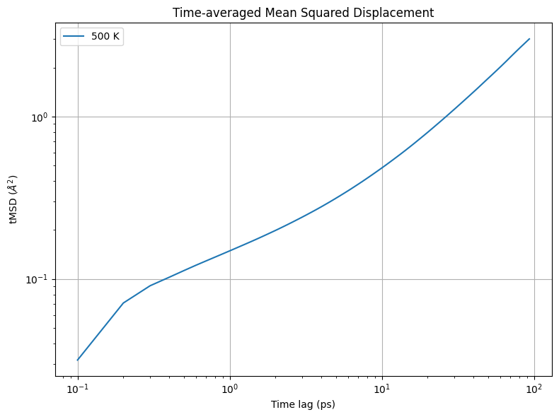
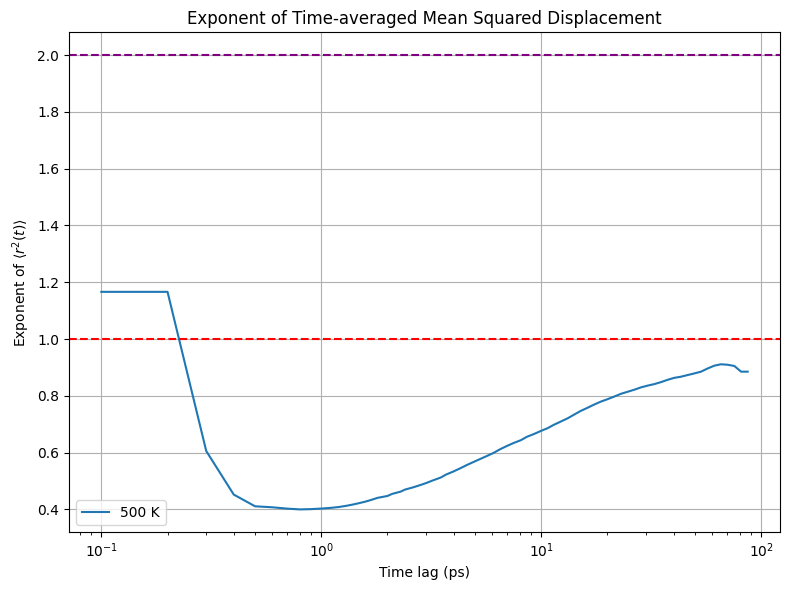

# DiffusionAnalysis

DiffusionAnalysis is a Python package for analyzing diffusion properties from molecular dynamics (MD) trajectories. It offers a suite of tools to calculate and visualize various quantities that characterize diffusive behavior, including mean squared displacements (MSD), van Hove correlation functions, and time-dependent mean squared displacements (tMSD).

:)

###TODO
VAC's .. COM VAC's ... watch this space!

## Features
- Efficient calculation of mean squared displacements (MSD) for selected atoms or groups of atoms
- Drift correction options for MSD calculations to account for system-wide translations
- Calculation of MSD along specific lattice vectors to study anisotropic diffusion
- Flexible plotting functions for visualizing MSD data with customizable options
- Computation of van Hove correlation functions to analyze dynamical heterogeneity
- Calculation of time-dependent mean squared displacements (tMSD) to study diffusion behavior over time
- Probability distribution analysis of displacements along lattice vectors and in 3D space

## Package Structure

```
DiffusionAnalysis/
│
├── analysis/
│   ├── msd_analysis.py
│   ├── tMSD_analysis.py
│   └── van_hove_analysis.py
│
├── examples/
│   ├── dat_directory/
│   └── example.ipynb
│
├── loaders/
│   ├── ase_atoms_loader.py
│   ├── base_structure_loader.py
│   ├── dat_directory_structure_loader.py
│   └── xyz_directory_structure_loader.py
│
├── trajectory/
│   ├── displacement_trajectory.py
│   ├── smoothing.py
│   └── time_unit.py
│
├── utils/
│   └── __init__.py
│
├── diffusionanalysis.egg-info/
├── .gitignore
├── LICENCE
├── README.md
├── requirements.txt
└── setup.py
```

## 
Loaders
The loaders module provides classes for loading and storing an iterable of structures that lazy load. The key classes include:

- ```StructureLoader```: An abstract base class that defines the interface for structure loaders.
- ```DatDirectoryStructureLoader```: A loader class for loading structures from a directory of .dat files.
- ```XYZDirectoryStructureLoader```: A loader class for loading structures from a directory of .xyz files.
- ```ASEAtomsLoader```: A loader class for loading structures using the ASE (Atomic Simulation Environment) library.

These loaders allow you to easily load MD trajectories from various file formats and integrate them seamlessly with the DiffusionAnalysis package.

## Analysis
The analysis module contains classes for performing different types of diffusion analysis on the loaded trajectories. The main classes include:
- MSDAnalysis: Performs mean squared displacement (MSD) analysis, including drift correction and calculation of MSD along specific lattice vectors.



- VanHoveAnalysis: Calculates van Hove correlation functions to analyze dynamical heterogeneity.


- tMSDAnalysis: Calculates time-dependent mean squared displacements (tMSD) to study diffusion behavior over time.



## Usage
Here's an example demonstrating how to use DiffusionAnalysis to calculate and plot the MSD:
python

```python
from DiffusionAnalysis.loaders import DatDirectoryStructureLoader
from DiffusionAnalysis.trajectory import DisplacementTrajectory
from DiffusionAnalysis.analysis import MSDAnalysis

# Load the MD trajectory
loader = DatDirectoryStructureLoader("path/to/trajectory")
trajectory = DisplacementTrajectory(loader)
trajectory.generate_displacement_trajectory()

# Perform MSD analysis
msd_analysis = MSDAnalysis(trajectory)
msd_data = msd_analysis.calculate_msd()

# Plot the MSD
fig = msd_analysis.plot_msd(msd_data)
fig.savefig("msd_plot.png")
```
For more detailed examples and usage instructions, please refer to the examples directory.

## Installation
You can easily install DiffusionAnalysis:

```bash
git clone https://github.com/chrisdavi3s/DiffusionAnalysis.git
cd DiffusionAnalysis
pip install -r requirements.txt
```
Install the package in development mode:

```bash
pip install -e .
```
## Getting Started

Look at loaders/base_structure_loader.py to see how structures are loaded. 

Trajectories are assumed wrapped and then unwrapped as default ... (I have NOT tested on a already unwrapped trajectory)

## License
This project is licensed under the MIT License - see the LICENSE file for details.
